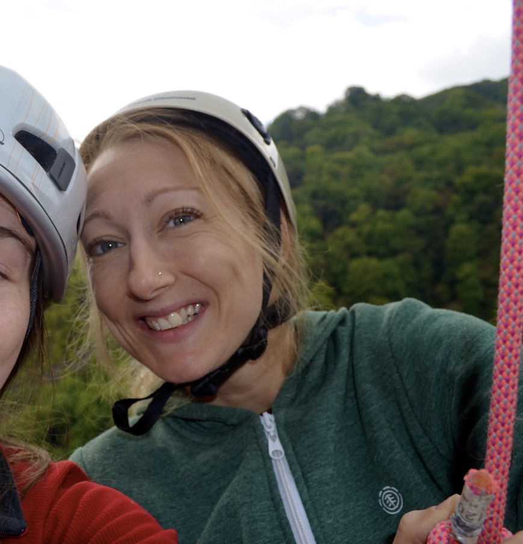
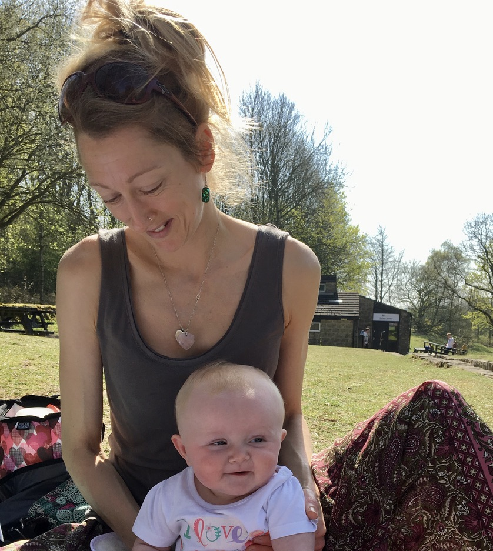

## Book your post lock down cut and colour now!

### Services are available to book now for dates 12th April onwards.

### Contact now for a free phone consultation
**07788606263 - text / WhatsApp**

### Price list
- Cut and finish £22.00
- Retouch £34.00
- Full head £42.00
- Highlights £55.00
- Balaylage £60.00
- Colour correction from £65
- Occasion styling: from £15
- Travel cost over 20 miles from Derby £5.00
- Under 5s £5.00
- Under 10s: £10

### Discounts
- Regular customers benefit from a 10% discount.

### About Clare:

Clare is an independent hairdresser based in the Derby area. Clare offers a wide range of professional colouring and styling services with superior, personal service, hassle-free in your own home. 

Clare trained with X and built up her expertise through work in salons for X years before setting up an independent business to allow her to offer her clients a personal services withing the comfort of their own homes.

### COVID 19 Safety Measures:
Clare will wear a type II face mask and visor for their arrival and the duration of the appointment, and gloves where appropriate. Customers are asked to wear a face covering.

All equipment and tools will be thoroughly disinfected before each appointment, and clients are asked to provide their own towels for this period. All government guidance on hygiene will be followed including regular handwashing and frequent sanitisation of any surfaces used.

Clients (and their households) must be symptom-free on the day of the appointment. Treatments are to take place by an open window or in an area with good ventilation. 

Clare is fully insured for X.

### Portfolio

### Reviews
